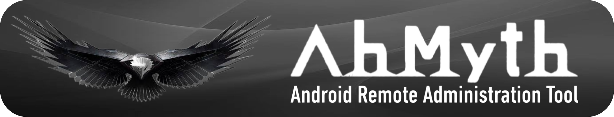

<picture>
  <source media="(prefers-color-scheme: dark)" srcset=".github/IMG/AhMyth-light-banner.png">
  
</picture>

 
 

         

#
Give this repository a 💫 to support the project.

Contributions are more than welcome as this repository will continue to be maintained.
#

## 
<ins>Usage</ins>

01. Build a standalone APK Payload or use an original APK as a Payload Template.

02. Install the APK Payload on the Victim Android Device.

03. Take Control of the Victim Android Device by using the *Victim's Lab*.
#

## 
<ins>Installation</ins>

You can install AhMyth by using either the *Source code*, or by using the *Binary files*.

Instructions for installing AhMyth using either the *Source Code* or the *Binary Files*, can be found in the following Setup Wiki Pages.

 

### 
<ins>Source Code Setup</ins>

- [AhMyth Wiki: Page 1 - Source Code Setup: Linux](https://github.com/Morsmalleo/AhMyth/wiki/Page-1.-Source-Code-Setup:-Linux)
- [AhMyth Wiki: Page 2 - Source Code Setup: macOS](https://github.com/Morsmalleo/AhMyth/wiki/Page-2.-Source-Code-Setup:-macOS)
- [AhMyth Wiki: Page 3 - Source Code Setup: Windows](https://github.com/Morsmalleo/AhMyth/wiki/Page-3.-Source-Code-Setup:-Windows)

 

### 
<ins>Binary Setup</ins>

- [AhMyth Wiki: Page 4 - Binary Setup: Linux](https://github.com/Morsmalleo/AhMyth/wiki/Page-4.-Binary-Setup:-Linux)
- [AhMyth Wiki: Page 5 - Binary Setup: macOS (Being Written)](https://github.com/Morsmalleo/AhMyth/wiki/Page-5.-Binary-Setup:-macOS)
- [AhMyth Wiki: Page 6 - Binary Setup: Windows](https://github.com/Morsmalleo/AhMyth/wiki/Page-6.-Binary-Setup:-Windows)
#

## 
<ins>User Manual</ins>

A full User Manual for new users of AhMyth can be found in the following Wiki pages.

- [AhMyth Wiki: Page 7 - User Manual](https://github.com/Morsmalleo/AhMyth/wiki/Page-7.-User-Manual)
#

## 
<ins>Troubleshoot</ins>

A full Troubleshoot page detailing known errors when running AhMyth using either the *Source Code* or the *Binary Files*, can be found in the AhMyth Wiki. 

You can find the Troubleshoot Sections for both Source Code Usage errors and Binary Usage errors, in the following AhMyth Wiki page.

- [AhMyth Wiki: Page 8 - Troubleshoot](https://github.com/Morsmalleo/AhMyth/wiki/Page-8.-Troubleshoot)
#

## 
<ins>Posting Issues</ins>

Any issues with AhMyth, must be posted using the *[Issue Templates](https://github.com/Morsmalleo/AMyth/issues/new/choose)* accordingly.

The following list will help users determine which Issue Template is suitable for their problem.

 

### 
<ins>Issue Templates</ins>

- [Server Bug Report](https://github.com/Morsmalleo/AhMyth/issues/new?assignees=Morsmalleo&labels=bug%2C+error&template=server-bug-report.md&title=)

Use this issue Template if you experience problems like Buggy/Unusable Victim's Lab Features, or `Building Failed errors with Standalone APK Payloads`.

- [Client Bug Report](https://github.com/Morsmalleo/AhMyth/issues/new?assignees=Morsmalleo&labels=bug%2C+error&template=client-bug-report.md&title=)

Use this Issue Template if you experience things such as Flickering Victim Connections with Standalone APK Payloads, or any sort of bug or instability with Standalone APK payloads.

- [Binding Report](https://github.com/Morsmalleo/AhMyth/issues/new?assignees=Morsmalleo&labels=bug%2C+error&template=binding-report.md&title=)

Use this Issue Template when you are greeted with any errors when using the Binding Features, Flickering Connections after Binding, or if any applications break/crash after Binding.

- [Feature Request](https://github.com/Morsmalleo/AhMyth/issues/new?assignees=Morsmalleo&labels=enhancememt&template=feature_request.md&title=)

Use this Template if you wish to request an upgrade that hasnt already been integrated.

 

### 
<ins>Blank Issues</ins>

If you experience errors that arent related to any of the *Issue Templates*, or if you cant seem to fix your problem using the *Troubleshoot Manual*, then please start a *[Blank Issue](https://github.com/Morsmalleo/AhMyth/issues/new)* and post it with enough valid information about the problem.

We work hard here to keep the *Issues Section* as clean and as understanding as possible, so please help us to do that by using the *Issue Templates* or by providing non-template Issues with decent information.

Duplicate Issues will also be removed without question if I can see that the user was to lazy to check the closed issues.
#

## 
<ins>Information</ins>

For those looking to study this unique RAT, you can find all the information you'll need to know about AhMyth and it's payload in the following AhMyth Wiki sections;

- [AhMyth Wiki: Home](https://github.com/Morsmalleo/AhMyth/wiki)
- [AhMyth Wiki: Page 9 - Dissecting a RAT: Analysis of AhMyth](https://github.com/Morsmalleo/AhMyth/wiki/Page-9.-Dissecting-a-RAT:-Analysis-of-AhMyth)
#

## 
<ins>Screenshots</ins>

| | | |
|:-------------------------:|:-------------------------:|:-------------------------:|
|<a href="https://github.com/Morsmalleo/AhMyth/blob/master/.github/IMG/MainScreen.PNG">  Main Screen</a> | <a href="https://github.com/Morsmalleo/AhMyth/blob/master/.github/IMG/ApkBuilder(Standalone).PNG">  Standalone APK Builder </a> | <a href="https://github.com/Morsmalleo/AhMyth/blob/master/.github/IMG/ApkBuilder(Bound).PNG">  APK Payload Binder  </a> | 
<a href="https://github.com/Morsmalleo/AhMyth/blob/master/.github/IMG/VictimsLab.PNG">  Victims Lab </a> | <a> COMING SOON! </a> | <a> COMING SOON! </a> |
#

## 
<ins>Credits & Specials Thank's</ins>

Created by
- [Ahmed Al 'AhMyth' Hajri](https://github.com/AhMyth)

Maintained with ❤️ by
- [Morsmalleo](https://github.com/Morsmalleo)

Special Thanks to
- [HiddenPirates](https://GitHub.com/HiddenPirates) - For his brilliant amount of work on upgrading the Client & the Server
- [YagamiLight17](https://github.com/YagamiLight17) - For his brilliant contributions towards upgrading the Server & for integrating the *Customs Permissions*  feature
- [yogeshwaran01](https://github.com/yogeshwaran01) - For his creation of the URL Masker, which was modified by YagamiLight for AhMyth.
